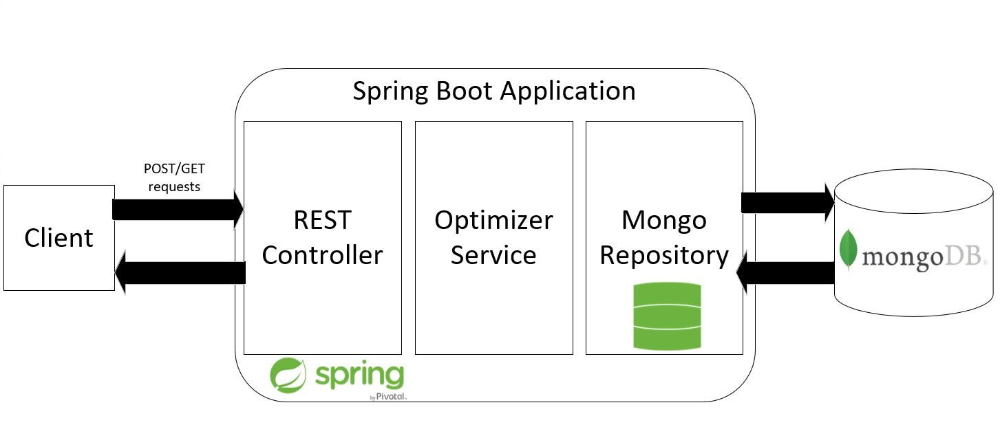

# Knapsack Optimizer Service

## Technology Stack
* Java 8
* Spring Framework 4.3
* Mongo DB 3.6

## Architecture

* Spring MVC REST controller
* Dynamic Programming Knapsack Optimizer
* Spring data mongo repository
* mongo DB NoSQL database

## Submit Task

## Code Structure

## API documentation

[REST API documentation](knapsack-optimizer-service/REST_API_doc.md)

